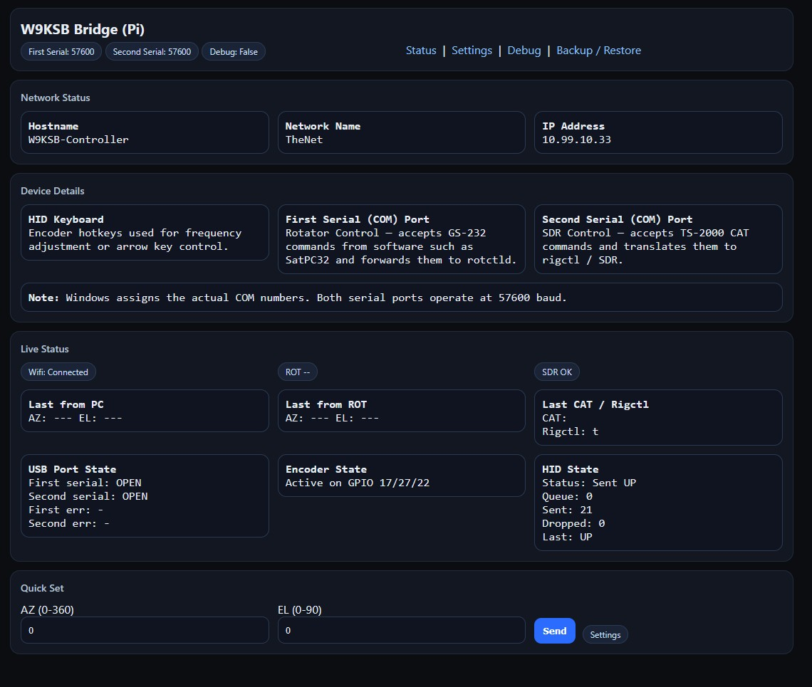
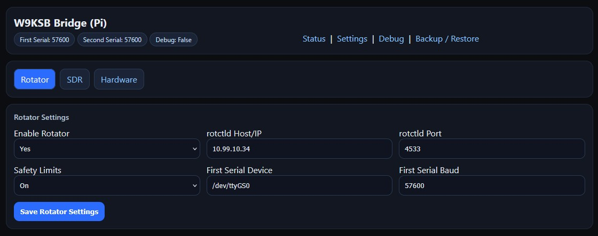
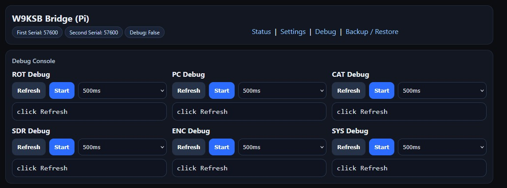

# W9KSB SatOps Controller


## Quick Start

Clone the repository and run the installer:

```bash
git clone https://github.com/W9KSB/W9KSB-SatOps-Controller
cd W9KSB-SatOps-Controller
chmod +x install.sh
sudo ./install.sh
sudo reboot
```

After reboot the system will automatically:

- Create the USB dual COM port gadget
- Start the controller service
- Be ready for SatPC32

  For the two com ports that are created, you can connect to either with a terminal application like Putty and baudrate of 57600. You will get a header displaying if it's the rotator or CAT com port. Then you know which to map to what in SatPC32.

---

# W9KSB SatOps Controller

The **W9KSB SatOps Controller** is a Raspberry Pi based satellite operations console designed to integrate seamlessly with **SatPC32**, **Hamlib rotctld**, and modern network rotators. The goal is to take applications like SatPC32 that work traditionally with local serial \ usb com ports and provide a bridge to network based hardware.

The system provides:

* GS‑232 rotor emulation and rotctld network bridge
* rigctl network bridge for SDR applications such as SDR++
* USB dual virtual COM ports
* hardware frequency control via rotary encoder to emulate +\- or up\down key presses in SatPC32
* live web monitoring interface

This project is provided for **educational and hobby use**. Use at your own risk.

---

# Architecture

```
SatPC32
   │
   │  GS‑232 Serial (USB Virtual COM)
   ▼
W9KSB SatOps Controller (Raspberry Pi)
   │
   │ TCP/IP
   ▼
rotctld (Hamlib)
   │
   ▼
Network Rotor
```

Simultaneously:

```
Rotary Encoder
      │
      ▼
Keyboard Emulation
      │
      ▼
SatPC32 Frequency Control
```

Also:

```
SatPC32
      │
      │ CAT control
      ▼
W9KSB SatOps Controller (Raspberry Pi)
      │
      │ TCP/IP
      ▼
rigctl (Hamlib)
      │
      ▼
SDR Application Frequency control
```
---

# Dual COM Ports

When connected to a PC the controller appears as:

```
W9KSB SatOps Controller
   USB Serial Device (COMx) → Rotator Control (GS‑232)
   USB Serial Device (COMy) → CAT / SDR Control
```

Port assignments are handled automatically by Windows.

---

# Features

## GS‑232 Rotor Emulation

SatPC32 expects a physical GS‑232 rotor controller.  
The SatOps Controller emulates this interface and translates commands to **Hamlib rotctld** over TCP/IP.

This allows modern **network rotators** to work seamlessly with legacy GS‑232 software.

---

## Hardware Frequency Control

Satellite operation requires constant small adjustments.

This system provides a **rotary encoder with push button** that allows:

* TX alignment calibration
* passband repositioning
* RX/TX lane shifting

The encoder sends **keyboard commands directly to SatPC32**.

## SDR Frequency Control (rigctl Bridge)

The controller also provides a second virtual serial port that allows SatPC32 to control SDR software using the Hamlib rigctl protocol.

Many SDR applications expose frequency control through rigctld / rigctl instead of traditional CAT interfaces.

The SatOps Controller bridges this gap by:

Receiving rigctl-compatible CAT commands from SatPC32, Forwarding them over the network to an SDR rigctl server, Returning frequency and status responses back to SatPC32

This allows SDR software such as SDR++ to be controlled directly by SatPC32 without additional virtual COM software.

---

# Photos

## Device


## Web Interface





---

# Hardware Requirements

* Raspberry Pi Zero / Zero 2 W / Pi 4 (USB OTG capable)
* 20x4 I2C LCD
* EC11 rotary encoder
* Network connection
* rotctld compatible rotor
* SatPC32 on Windows


# 🔌 Wiring & Pinout

Below is the reference wiring configuration used for the **W9KSB SatOps Controller**.

> ⚠️ GPIO numbers use **BCM numbering**, not physical pin numbers.

---

# 📟 LCD (20x4 I2C)

The controller uses a standard **HD44780-compatible 20x4 LCD with an I2C backpack**.

| LCD Pin | Raspberry Pi Pin | Notes |
|--------|------------------|------|
| VCC | 5V | LCD power |
| GND | GND | Common ground |
| SDA | GPIO 2 | I2C data |
| SCL | GPIO 3 | I2C clock |

Default I2C address:

```
0x27
```

If your display does not respond, run:

```
i2cdetect -y 1
```

to discover the address.

---

# 🎛 Rotary Encoder (EC11)

The controller uses a **standard mechanical EC11 rotary encoder with push button**.

The encoder **does not require a VCC pin** — it simply shorts signal lines to ground.

## Encoder Rotation Pins

| Encoder Pin | Raspberry Pi Pin | Notes |
|-------------|------------------|------|
| A (CLK) | GPIO 17 | Input with internal pull‑up |
| B (DT) | GPIO 27 | Input with internal pull‑up |
| Common | GND | Shared ground |

## Encoder Push Button

| Encoder Pin | Raspberry Pi Pin | Notes |
|-------------|------------------|------|
| SW | GPIO 22 | Button input with internal pull‑up |
| SW GND | GND | Shared ground |

---

# 🧠 GPIO Summary

| Function | GPIO |
|----------|------|
| Encoder A | GPIO 17 |
| Encoder B | GPIO 27 |
| Encoder Button | GPIO 22 |
| LCD SDA | GPIO 2 |
| LCD SCL | GPIO 3 |

---

# 📍 Raspberry Pi Header Reference

```
3V3  (1) (2) 5V
GPIO2(3) (4) 5V
GPIO3(5) (6) GND
GPIO4(7) (8) GPIO14
GND  (9) (10)GPIO15
GPIO17(11)(12)GPIO18
GPIO27(13)(14)GND
GPIO22(15)(16)GPIO23
3V3 (17) (18)GPIO24
GPIO10(19)(20)GND
GPIO9 (21)(22)GPIO25
GPIO11(23)(24)GPIO8
GND (25) (26)GPIO7
```

Pins used by the controller are highlighted in the wiring tables above.

---

# Installation

The project includes a full automated installer.

```bash
git clone https://github.com/W9KSB/W9KSB-SatOps-Controller
cd W9KSB-SatOps-Controller
chmod +x install.sh
sudo ./install.sh
```

The installer automatically:

* Enables USB OTG
* Installs Python dependencies
* Installs systemd services
* Configures the USB dual COM port gadget
* Starts the SatOps Controller service

Reboot when prompted.

---

# Web Interface

The controller includes a built‑in web interface.

Accessible at:

```
http://<controller-ip>/
```

Features:

* rotator telemetry
* command logs
* debug console
* system configuration

---

# SatPC32 Configuration

Use the following settings:

```
Rotor Type: GS‑232
Baud Rate: 57600
Flow Control: None
```

Then select the COM port corresponding to **Rotator Control**.

---

# Parts List

Example components used during development:

* Raspberry Pi Zero 2 W (or Original Raspberry Pi Zero) - https://amzn.to/4lsCmdH
* 20x4 I2C LCD - https://amzn.to/4bjcsVe
* EC11 Rotary Encoder - https://amzn.to/4bijn0Y
* USB‑C panel mount extension - https://amzn.to/3Pz3Qm2
* jumper wires - https://amzn.to/4t3Gkwj
* Micro-sd Card - https://amzn.to/3PjbrFf

---

# Project Status

Currently working and in active use for live satellite passes.

Future ideas:

* additional CAT protocols
* automatic satellite pass profiles

---

# Disclaimer

This project is provided for educational and amateur radio experimentation.

The author assumes no responsibility for equipment damage or misuse.
